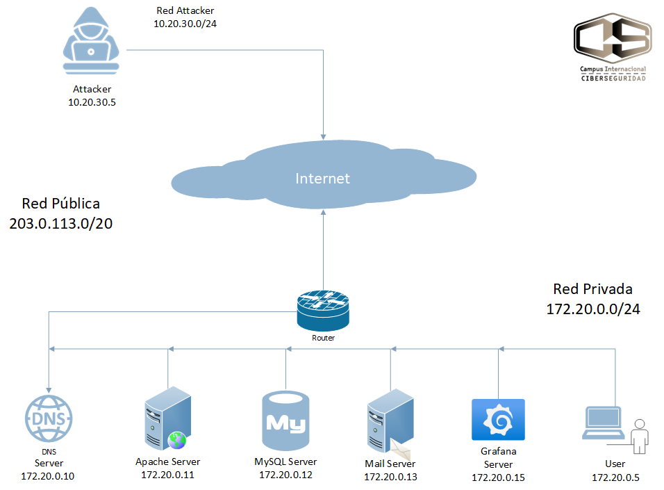

# Laboratorio CTF con Docker – Modo de uso

> **Aviso legal**: Este laboratorio es **exclusivamente educativo**. No expongas servicios a Internet ni utilices los contenedores para actividades fuera del entorno de prácticas.



## ¿Qué es?
Un laboratorio “**Capture The Flag**” (CTF) que simula una mini‑empresa con servicios reales (web, base de datos, correo, DNS y monitorización) desplegados con **Docker**. Incluye dos puestos de trabajo:

- **Attacker** (equipo del alumno atacante)
- **User** (usuario corporativo con cliente de correo)

Todo corre en tu máquina y es reproducible con `docker compose`.

---

## Requisitos
- Docker Desktop o Docker Engine ≥ 24
- Docker Compose V2 (`docker compose …`)
- 6–8 GB de RAM libres recomendados
- Puertos libres en el host (por defecto): **80**, **443**, **3000**, **53/udp**, **6080**, **6081**, **2227**  
  > Si alguno está ocupado, ajusta los *ports* en `docker-compose.yml`.

---

## Arranque rápido
```bash
# 1) Clona el repositorio
git clone https://github.com/ciervovolador/TFMMCB25
cd TFMMCB25

# 2) (Opcional) copia y edita variables
cp .env.example .env

# 3) Levanta el laboratorio
docker compose up -d

# 4) Verifica
docker compose ps
```
> Para **parar**: `docker compose down`  
> Para **parar y limpiar volúmenes** (reset total): `docker compose down -v`

---

## Arquitectura (resumen)
- **Red Pública** `203.0.113.0/20` → *Attacker* + *Router*
- **Red Privada** `172.20.0.0/24` → DNS, Apache, MySQL, Mail, Grafana, User
- **Red de Ataque** `10.20.30.0/24` → Attacker (aislado para pivoting)

Dominios **internos** resueltos por el DNS del laboratorio:
- `www.inseguracorp.com` → **Apache (web vulnerable)**
- `masterciberseguridad.com` → **Mail (correo)**

> Los dominios anteriores **resuelven dentro del laboratorio**. Desde tu host puedes usar **localhost** o añadir una entrada en `/etc/hosts` si quieres acceder por nombre (ver *FAQ*).

---

## Servicios y accesos
| Rol / Servicio | Cómo acceder desde tu **host** | Notas |
|---|---|---|
| **Attacker – noVNC (escritorio web)** | `http://localhost:6081` | Navegador con herramientas (Nmap, Metasploit, etc.). |
| **User – noVNC (escritorio web)** | `http://localhost:6080` | Cliente de correo **Thunderbird** preconfigurado. |
| **Web vulnerable (Apache)** | `http://localhost` (o `:80`) | Internamente: `http://www.inseguracorp.com`. |
| **Grafana** | `http://localhost:3000` | Panel de monitorización (incluye flag). |
| **DNS** | puerto **53/udp** | Usado por Attacker y User dentro del lab. |
| **SSH Attacker (opcional)** | `ssh -p 2227 user@localhost` | Si está habilitado en `docker-compose.yml`. |

**noVNC** te permite trabajar con **entornos gráficos** sin instalar nada en tu equipo.  
- Attacker: `http://localhost:6081`  
- User: `http://localhost:6080`

---

## Modo de uso (paso a paso)

### A) Empezar como **Attacker** (práctica ofensiva)
1. Abre `http://localhost:6081` → **escritorio Attacker**.
2. Reconocimiento con **Nmap** de los servicios publicados (53, 80/443, 3000).
3. Entra a `http://www.inseguracorp.com` (DNS interno lo resuelve) y explora vulnerabilidades (SQLi, XSS, CSRF).
4. (Opcional) Envía un **correo** desde el **formulario** de la web vulnerable a un usuario interno (*User*).

### B) Empezar como **User** (simulación de víctima)
1. Abre `http://localhost:6080` → **escritorio User**.
2. Abre **Thunderbird**: está **configurado** contra el servidor de correo del laboratorio (`masterciberseguridad.com`).
3. Revisa los mensajes recibidos (p. ej., enviados desde el **formulario** de la web) y navega a la web corporativa.

---

## Comandos útiles
```bash
# Ver logs de un servicio
docker compose logs -f apache
docker compose logs -f mail

# Entrar a un contenedor
docker compose exec attacker bash
docker compose exec user bash

# Reiniciar sólo la web
docker compose restart apache

# Reset completo (¡borra datos!)
docker compose down -v
docker volume prune -f
```

---

## FAQ / Problemas comunes

**1) El puerto 53/80/443/3000/6080/6081/2227 ya está en uso.**  
Edita los *ports* en `docker-compose.yml` o libera el puerto en tu sistema.

**2) noVNC no carga.**  
Comprueba que el servicio está **up/healthy**:
```bash
docker compose ps
docker compose logs -f attacker
```
Si es necesario, reinicia: `docker compose restart attacker user`.

**3) ¿Cómo vuelvo al estado inicial?**  
`docker compose down -v && docker volume prune -f` (elimina datos/flags generados).

---

## Alcance y limitaciones
- **Modo monousuario**: un atacante y un usuario por despliegue.
- No incluye aún **IDS/IPS** ni **SIEM** (previsto en el roadmap).
- Escenarios base (web, correo, pivoting, DNS) pensados para prácticas de 2–4 horas.

**Roadmap**
- Multiusuario y *scoreboard* para clases/CTFs.
- Integración **Wazuh/Suricata** y recolección de eventos.
- Más escenarios (APIs, IoT, cloud) y automatización (Terraform/Ansible).

---

## Estructura del repo (sugerida)
```
TFMMCB25/
├─ docker-compose.yml
├─ .env.example
├─ src/                 # configuraciones de servicios (apache, mail, dns, grafana, etc.)
├─ network.png          # diagrama de red (PNG)
└─ README.md

---

## Créditos y licencia
TFM – Laboratorio CTF con Docker  
Autor: Diego José García Rodríguez — Máster en Ciberseguridad  
Repositorio: `ciervovolador/TFMMCB25`  
Licencia: MIT 
